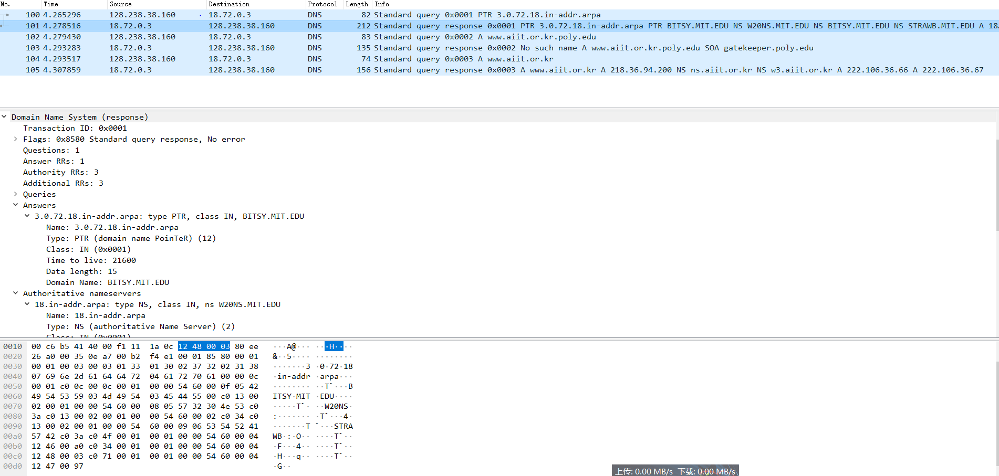
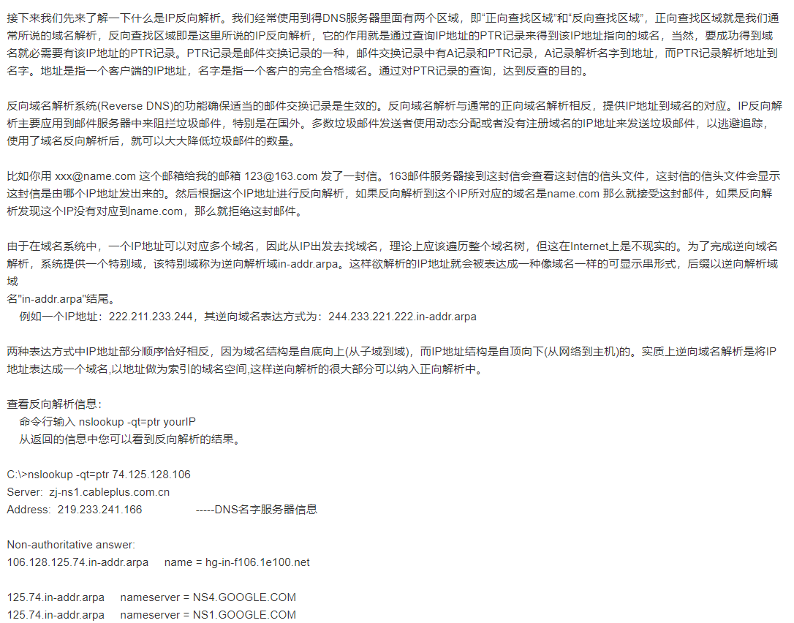

## 分析：

- 1、在这幅图中，当前主机向自己的dns服务器（18.72.0.3）发送IP地址反向解析请求PTR，请求解析3.0.72.18.in-addr.arpa我这个dns服务器地址的域名是什么。（什么是反向解析域见后面的截图）
- 2、然后该dns服务器会向这个主机在回答报文的answer区域返回自己的域名BITSY.MIT.EDU，同时在权威区域返回解析自己的权威dns服务器域名和地址。
- 3、在第三个dns查询报文中，主机向本地dns服务器请求解析www.aiit.or.kr.poly.edu这个域名；
- 4、在回答报文中，由answer rrs=0可以看出他的dns服务器并没有找到这个域名的地址，不过在在权威区域返回了一个SOA记录：（可能是在向查询主机告知解析这个域名详细信息最好向gatekeeper.poly.edu这个dns服务器查询下）
- 5、在第五行，主机向自己的dns服务器进行了关于www.aiit.or.kr A记录的查询
- 6、它的dns服务器向它返回了这个域名的IP地址，和解析这个地址的权威dns服务器的域名（NS记录，在权威区域）和IP地址（A记录，在附加区域）

